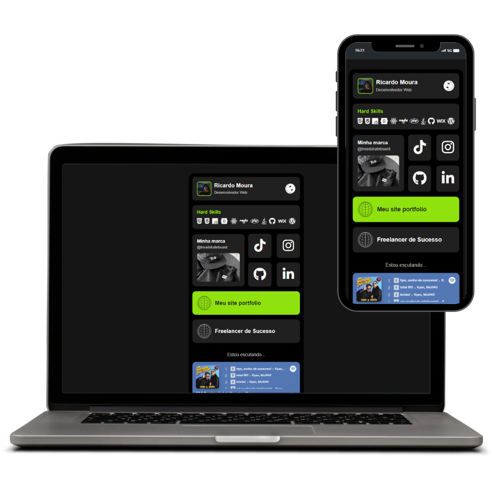

# Imagem do Projeto


# Meus Links - Italo Rolim│Dev

Este é um site pessoal desenvolvido por Italo Rolim para centralizar links importantes e destacar habilidades e projetos. A página inclui widgets com informações pessoais, habilidades técnicas, links para redes sociais, e muito mais.

## Características

- **Loading Screen Customizado:** Uma tela de carregamento animada que mostra o progresso em porcentagem até que o site esteja completamente carregado.
- **Perfil do Usuário:** Informações do desenvolvedor com foto, nome e título.
- **Habilidades Técnicas:** Ícones de tecnologias que destacam as hard skills do desenvolvedor.
- **Links para Redes Sociais:** Links diretos para TikTok, Instagram, GitHub e LinkedIn.
- **Widget de Marca Pessoal:** Link para a página do Instagram da marca Tread Skateboard.
- **Portfólio e Freelancer:** Links para o site de portfólio pessoal e um site com recursos para freelancers.

## Tecnologias Utilizadas

- HTML5
- CSS3
- JavaScript
- FontAwesome para ícones
- Roboto Font do Google Fonts

## Estrutura de Arquivos

```plaintext
/projeto
|-- index.html
|-- style.css
|-- animationLoading.js
|-- /img
    |-- user-perfil.png
    |-- smile-icon.png
    |-- web-black-icon.png
    |-- web-white-icon.png
    |-- tread-skateboard.jpg
```

## Contribuições

Contribuições são sempre bem-vindas! Se você tem alguma sugestão para melhorar este projeto, sinta-se à vontade para fazer um fork do repositório e enviar sua pull request.

## Autor

**Italo Rolim**
- [Perfil no GitHub](https://github.com/ItaloRolim)
- [LinkedIn](https://www.linkedin.com/in/italo-rolim-86a390291/)
- [Instagram](https://www.instagram.com/italoir_/)
